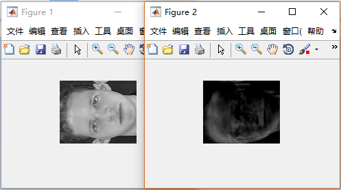

# 人工智能基础实验报告

# 基于PCA 的人脸识别技术

陈翊辉

PB15111656

## PCA算法

### PCA

> 在多元统计分析中，主成分分析（英语：Principal components analysis，PCA）是一种分析、简化数据集的技术。主成分分析经常用于减少数据集的维数，同时保持数据集中的对方差贡献最大的特征。这是通过保留低阶主成分，忽略高阶主成分做到的。这样低阶成分往往能够保留住数据的最重要方面。但是，这也不是一定的，要视具体应用而定。由于主成分分析依赖所给数据，所以数据的准确性对分析结果影响很大。

### 算法描述

###PCA

这里使用矩阵的特征值分解计算PCA

将原始数据$X$从$n$维降到$k$维：

* 对数据做归一化处理（$x_j:=x_j-μ_j$）
* 计算协方差矩阵($Σ=\frac{1}{m}X^TX$)
* 计算矩阵$Σ$的特征值与特征向量，按特征值的模降序排列([u, e, ~] = eig(sigma))
* 对数据降维$z = u[:k]^T * X$
* ……
* 若需要从降维的数据反推原数据$X_a=u[:k] * z$

该算法用Python及numpy实现比较容易，可以直接使用numpy的eig计算矩阵的特征值和特征向量。

### 人脸识别

使用曼哈顿距离作为识别的依据，在numpy中可以简单写作：

`np.sum(np.abs(x-x_))`

## 实验结果

不同阈值下降维后维数与正确率关系表（eig）

| 阈值   | 0.2    | 0.4    | 0.6    | 0.8    | 0.9    | 0.95   | 0.99   | 0.999  | 0.9999 | 1      |
| ------ | ------ | ------ | ------ | ------ | ------ | ------ | ------ | ------ | ------ | ------ |
| 维数   | 2      | 4      | 10     | 42     | 99     | 163    | 266    | 311    | 318    | 10304  |
| 正确率 | 45.00% | 76.25% | 91.25% | 93.75% | 95.00% | 88.75% | 88.75% | 90.00% | 90.00% | 90.00% |

不同阈值下降维后维数与正确率关系表（svd）

| 阈值   | 0.2    | 0.4    | 0.6    | 0.8    | 0.9    | 0.95   | 0.99   | 0.999  | 0.9999 | 1      |
| ------ | ------ | ------ | ------ | ------ | ------ | ------ | ------ | ------ | ------ | ------ |
| 维数   | 2      | 4      | 10     | 41     | 98     | 162    | 266    | 311    | 318    | 10304  |
| 正确率 | 43.75% | 85.00% | 96.25% | 98.75% | 98.75% | 95.00% | 95.00% | 96.25% | 96.25% | 96.25% |

## 结果分析

从以上结果来看，基本达到PCA的目的，原始数据为10304维;

经过PCA处理，在threshold为0.99下，维数只有266维，而正确率能达到95.00%左右；

当threshold为0.4，维数仅有4维，这时正确率仍有85.00%。

可以得到以下结论：

* 超过99.99%的“信息”集中在几百维

* 阈值越大，维数越大，
* 大体上维数越高识别正确率越高，但维数维40-100左右时正确率明显高于其他。

## 降维图像

可以用降维后的矩阵还原图像，得到类似“马赛克”的图像；

如99维后还原的图像（右）与原图（左）：

降维矩阵以thresold取0.99，163维为例，保存在文件`163d.mat`中(matlab格式)

## 对PCA的改进方案

### 图片预处理

整个PCA程序运行花费时间较多，通过对整个程序运行时间的分析发现，主要时间耗费在以下两项：

- 计算协方差矩阵($Σ=\frac{1}{m}X^TX$)
- 计算矩阵$Σ$的特征值与特征向量，按特征值的模降序排列([u, e, ~] = eig(sigma))

原因在于矩阵$X$较大。

解决方案：

直接对图片作简单的压缩处理：将图片中相邻的4个像素取平均值压缩为1个像素。（卷积核为2*2全为1的矩阵，步长为2的卷积操作）。

经实验验证，该操作可以使PCA的运行时间从10min下降到50sec左右，而正确率基本不变。

### 使用奇异值代替特征值

通过查阅资料，使用奇异值分解作PCA优于特征值分解。

并且奇异值分解能避免计算特征值中出现复数。

而矩阵的奇异值分解使用numpy的svd函数可以直接算出，需要注意的是，numpy的svd与matlab的svd稍有区别。

实验结果显示，使用svd的PCA比eig的PCA在正确率上有明显优势，见实验结果。